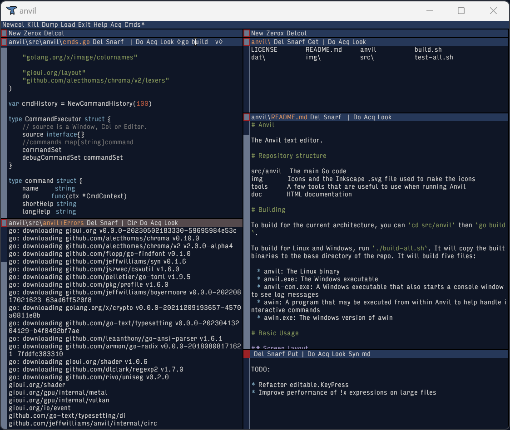

# The Anvil Text Editor

Anvil is a graphical, multi-pane tiling editor that makes bold use of the mouse and integrates closely with the shell. It supports syntax highlighting, multiple cursors and selections, remote file editing, and contains a powerful text manipulation language.

Anvil is inspired by [Acme](http://acme.cat-v.org/). Though if you've used Acme, there are some [major differences](articles/differences-from-acme.md).

## Thanks

Thank you to the [GIO](https://gioui.org/) developers and community working tirelessly to create a beautiful graphical user-interface library in Go, without which this editor would not be possible. 

Thanks to the Go team for creating a practical, portable, performant, and clean language that is a joy to write in.
