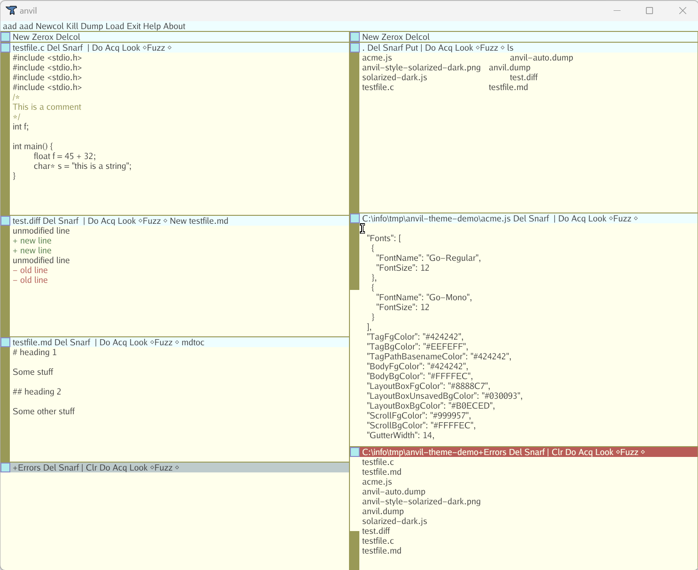
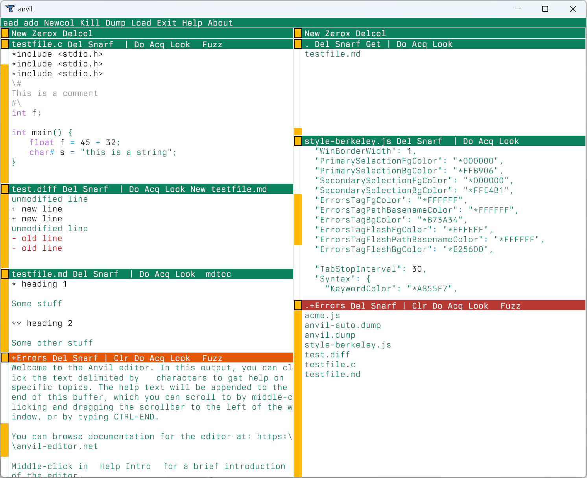
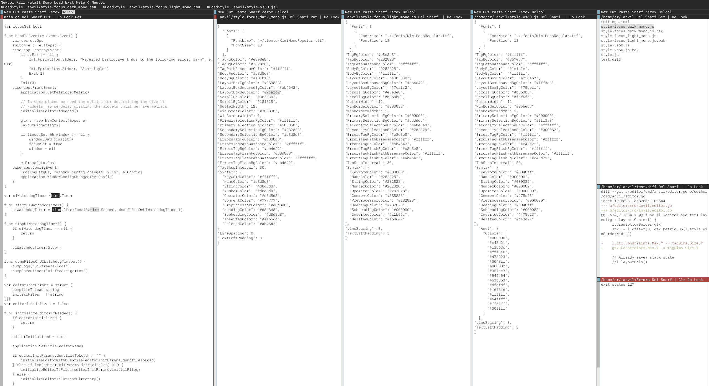
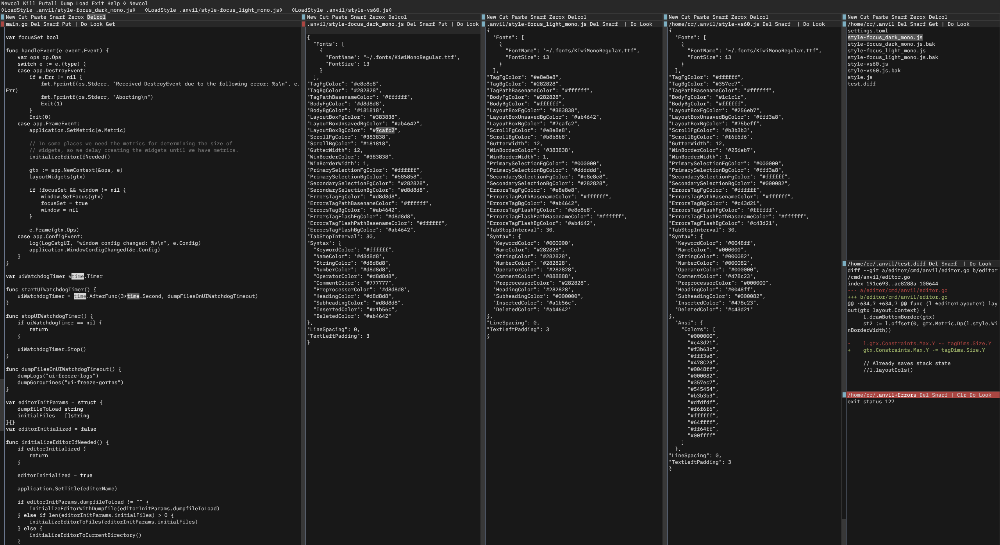
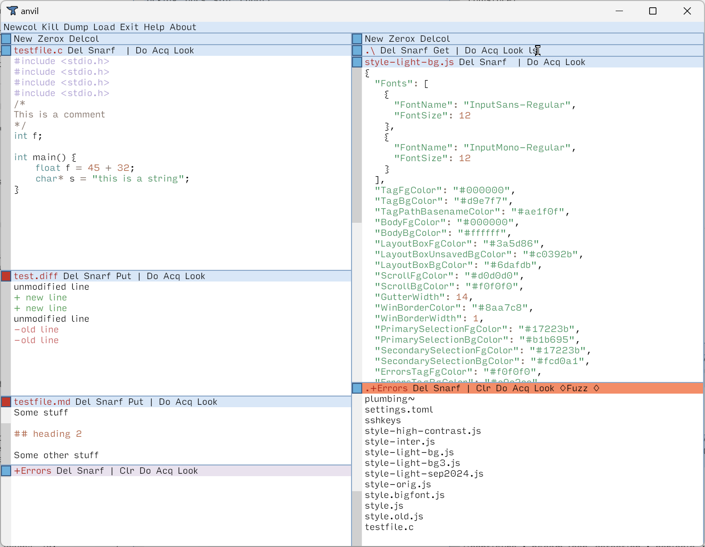
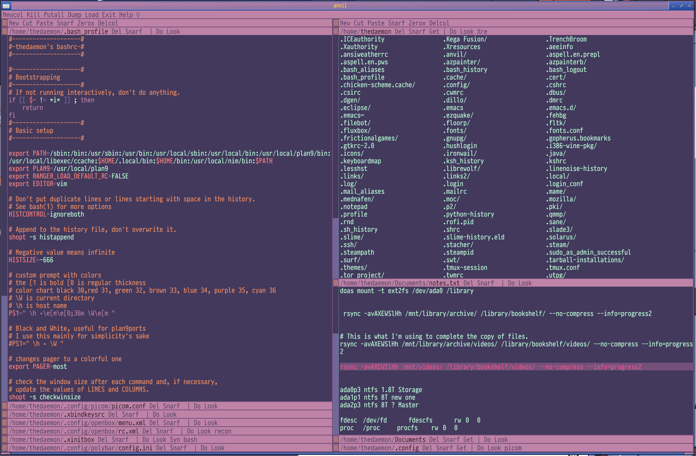
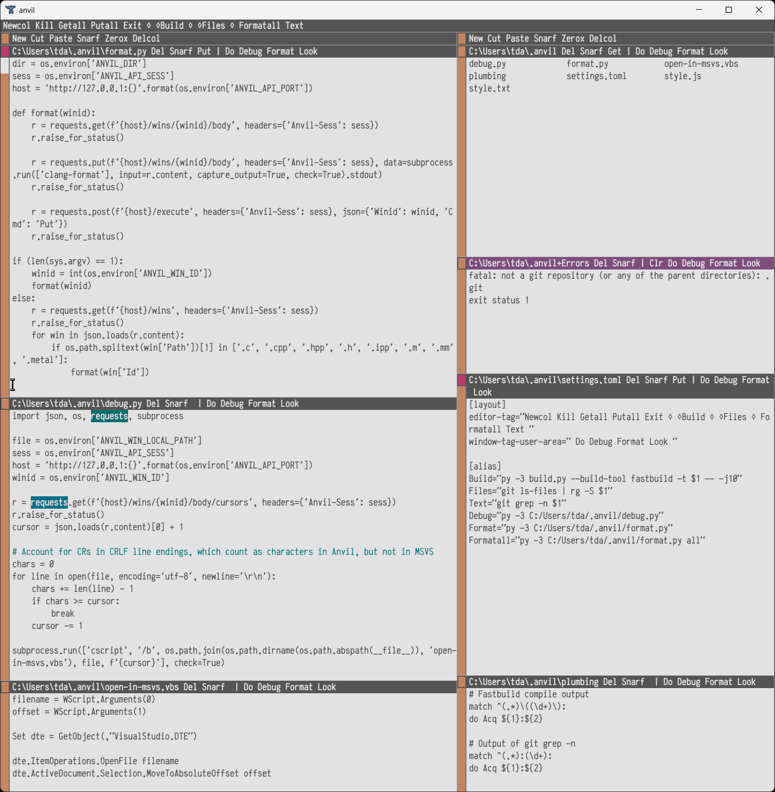
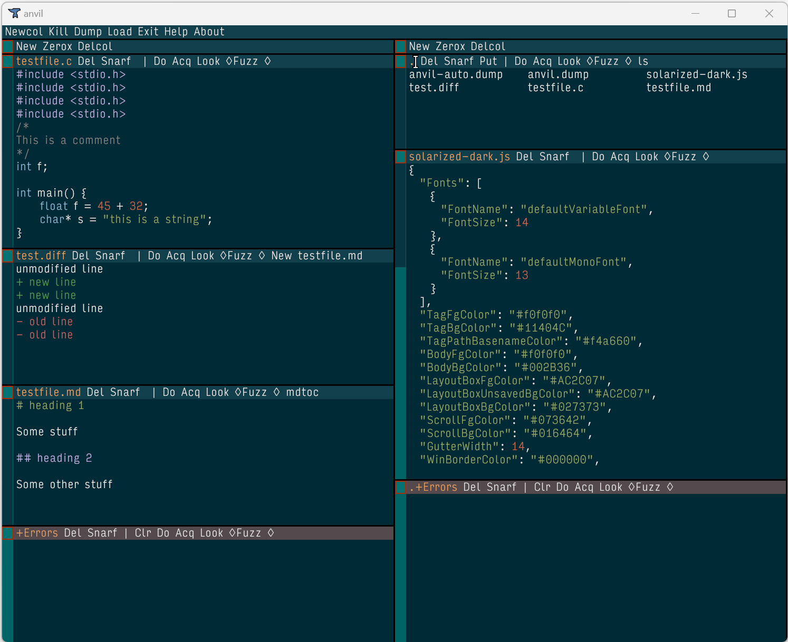
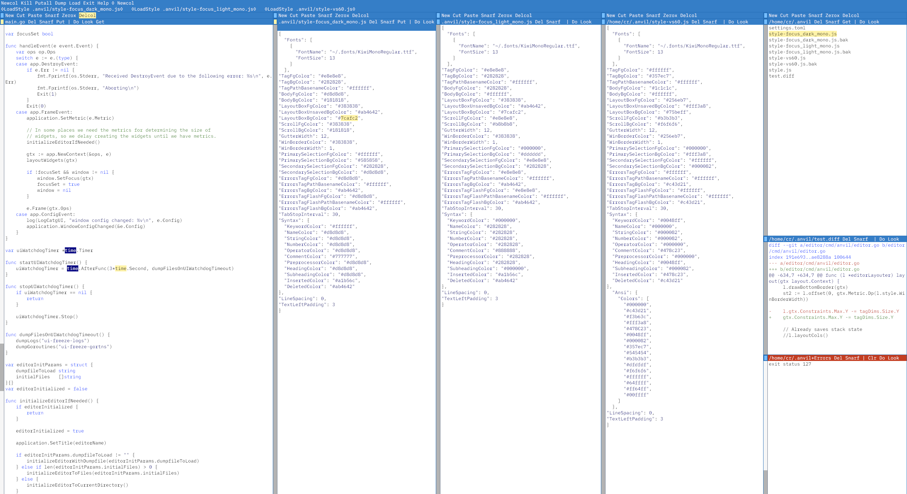
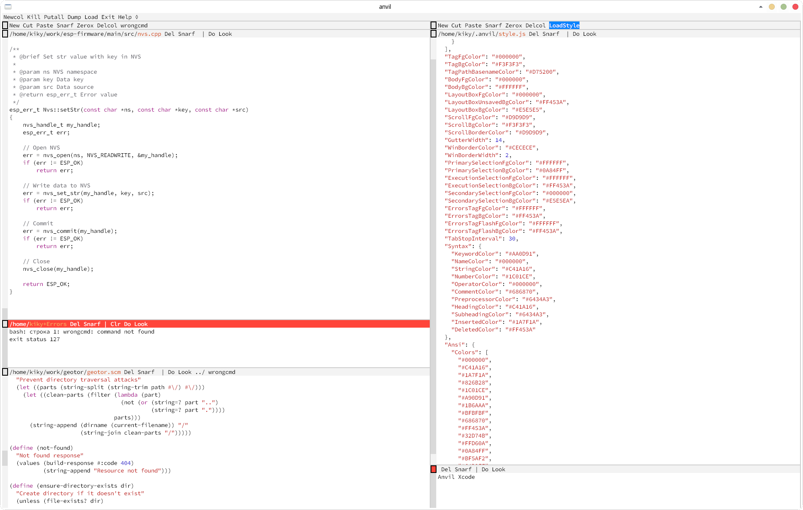

# Themes 

This page contains themes that can be downloaded to change the fonts and colors that Anvil uses. Use them by downloading one, renaming it to `style.js`, copying it to the Anvil [configuration directory](../reference/config.md), and loading it in Anvil by executing the command `LoadStyle`, or by restarting Anvil. 

To create a theme, try executing the 'SaveStyle' command, and editing the resulting file. See the [style.js format reference](../reference/config.md#stylejs) for details about the fields.

## Acme

A reproduction of the color scheme for the Acme editor. This was created for Anvil by Priv.

This theme uses two of the font styles of the Go fonts, which are close to the original default font used by Acme in Plan 9: Go Regular and Go Mono. The Go fonts can be downloaded [here](https://github.com/golang/image/tree/master/font/gofont/ttfs). They must be installed on the system to use this theme, or downloaded and referenced by the full file path from the style file. Alternately, you can instead download the version that uses the default fonts.

[Download Style Using Go Fonts ](style-acme.js)  
[Download Style Using Default Fonts](style-acme-default-font.js)

## Berkeley

Berkeley is a light theme for Anvil designed around the Berkeley Mono font. This was created for Anvil by 非公開. 

This theme is meant to be used with the Berkeley font, which can be purchased from the [U.S. Graphics website](https://usgraphics.com/products/berkeley-mono).

[Download](style-berkeley.js)

## Focus

Focus is a clean theme with minimal syntax highlighting. The intent is to prevent distraction due to excessive color. Highlighting is only used for important information.

Focus comes in both a light and dark variant. Focus is designed to be used with the Kiwi Mono font, which can be downloaded from [here](https://codeberg.org/yamagi/kiwimono/releases/download/v1.2/KiwiMonoRegular.ttf).

[Download Focus Light](style-focus-light.js)  
[Download Focus Light Using Default Fonts](style-focus-light-default-font.js)  
[Download Focus Dark](style-focus-dark.js)  
[Download Focus Dark Using Default Fonts](style-focus-dark-default-font.js)  

  

## Light

This is a light theme. 

Light uses two of the font styles from the Input font by David Jonathan Ross: Input Sans Regular, and Input Sans Mono. They can be downloaded for personal use [here](https://input.djr.com/download/). They must be installed on the system to use this theme, or downloaded and referenced by the full file path from the style file. Alternately, you can instead download the version that uses the default fonts.

[Download](style-light-bg.js)
[Download Style Using Input Fonts ](style-light-bg.js)  
[Download Style Using Default Fonts](style-light-bg-default-font.js)

## Sea Sky

Sea Sky theme for Anvil. This was created for Anvil by The Dæmon, based on the Openbox theme of the same name.

This theme is meant to be used with these fonts:

  * Pragmata Pro, which can be purchased from [Fabrizio Schiavi's website](https://fsd.it/shop/fonts/pragmatapro/)
  * Source Code Pro, downloadable from [Google Fonts](https://fonts.google.com/specimen/Source+Code+Pro)

Alternately, you can instead download the version that uses the default fonts.

[Download Style Using Special Fonts](style-seasky.js)  
[Download Style Using Default Fonts](style-seasky-default-font.js)

## Seoulbones Light

Sea Sky theme for Anvil. This was created for Anvil by Thomas, based on the iTerm2 color scheme [of the same name](https://github.com/mbadolato/iTerm2-Color-Schemes?tab=readme-ov-file#seoulbones-light).

This theme is meant to be used with the [Anka/Coder font](https://code.google.com/archive/p/anka-coder-fonts/), specifically the narrow bold version (found in [AnkaCoderNarrow.1.000.zip](https://storage.googleapis.com/google-code-archive-downloads/v2/code.google.com/anka-coder-fonts/AnkaCoderNarrow.1.000.zip) )

Alternately, you can instead download the version that uses the default fonts.

[Download Style Using Anka/Coder Fonts](style-seoulbones-light.js)  
[Download Style Using Default Fonts](style-seoulbones-light-default-font.js)

## Solarized Dark

Solarized Dark theme for Anvil. This was created for Anvil by Arsonist545 λ.

[Download](style-solarized-dark.js)

## VS60

A theme that harkens back to the days of Visual Studio 6.0. VS60 is designed to be used with the Kiwi Mono font, which can be downloaded from [here](https://codeberg.org/yamagi/kiwimono/releases/download/v1.2/KiwiMonoRegular.ttf).

[Download VS60](style-vs60.js)  
[Download VS60 Using Default Fonts](style-vs60-default-font.js)

## XCode

XCode is a light theme for Anvil created by [KikyTokamuro](https://github.com/KikyTokamuro/anvil-xcode).

This theme is meant to be used with the [Source Code Pro medium font](https://fonts.adobe.com/fonts/source-code-pro).

[Download](style-xcode.js)
[Download Using Default Fonts](style-xcode-default-font.js)

