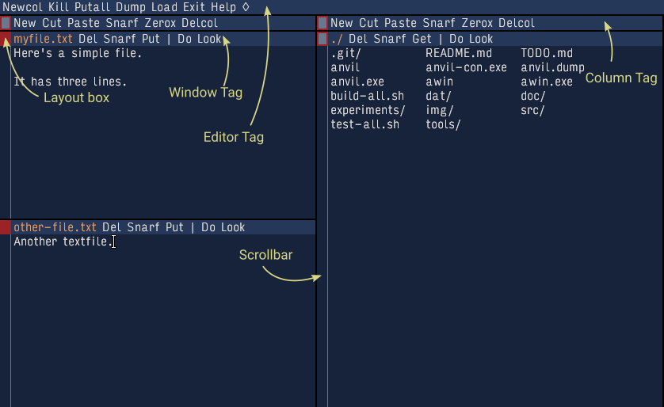
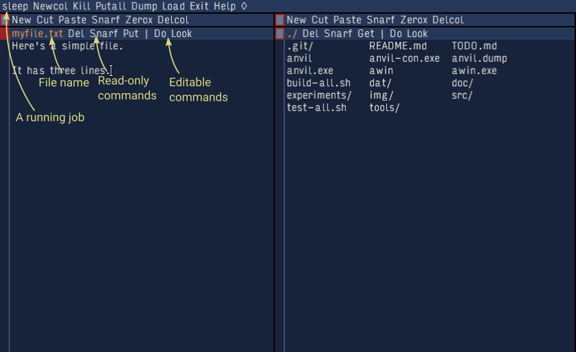

# Editor Layout

## Windows and Columns

Anvil consists of tiled windows. Windows are layed out in columns. Windows, columns and the editor itself each have a separated line of text at the top called the tag, which contains commands and—in the case of windows—the filename being edited in the window.

<figure markdown>
  
  <figcaption>Figure 1: Parts of Anvil</figcaption>
</figure>

Figure 1 shows the parts of the editor. In this example there are two columns. The leftmost column contains two windows; the top one is editing a file named `myfile.txt` and the bottom is editing `other-file.txt`. 

All of the visible columns and windows are actually part of an entity called a _layer_. You can create other layers with their own columns and windows, but only one layer is active at a time. We'll learn about layers later in the [Layer Tutorial](layers.md); for now we will just focus on a single layer.

### Try it: Moving Windows and Resizing Columns

You can move windows and resize columns by clicking with the left mouse button on a layout box and dragging the window. We're going to practice that now. 

1. Start anvil. It will start with two columns, and in the right column will be a window listing the contents of the current directory. In the tag of the left column, use the mouse to middle-click on the `New` command in the column tag. It will create a new empty window in the column. Middle-click it again to create a second empty window. 

2. Use the mouse to left-click-and-drag on the layout box of the bottom window and move it slightly higher. This will make it larger and the window above it smaller. 

3. Use the mouse to left-left-click-and-drag on the layout box of the right column and move it slightly left. This will resize the columns.

4. Use the left mouse button to drag the layout box of one of the empty windows in the left column into the right column and release the mouse button. The window will be moved to the right column. Repeat this for the other empty window in the left column. Now all three windows should be in the right column.

5. Drag the layout box of the bottom-most window in the rightmost column to a place between the first and second windows in that column. It will be repositioned to be between those two windows.

6. Right-click the layout box of one of the windows; it will minimize the others. Then middle-click the layout box of one of the windows; it will hide all the others. Right-click the layout box to unhide the other windows.

The video below demonstrates the steps.

### Demo Video


### Try it: Nudging a window

Sometimes you just need to see a little more text in a window. You can do this by left-clicking the layout box of the window: it will make that window a few lines larger, making the adjacent windows a little smaller if needed.

1. Start anvil. In the left column create a new empty window by middle-click on the `New` command in the column tag. Do that two more times so that there are three windows in the left column.

2. Nudge the middle window by left clicking it's layout box.

3. Without moving the mouse, click a few more times.

### Demo Video


## Tags 

The editor, columns, and windows each have a block at the top called the tag. Tags are editable: you can type in them to delete commands or add new commands, search terms or labels.

In order from left to right, the window tag consists of the filename, a read-only section ending with a pipe (|), then user area. The filename and user area are both editable.

The column tag consists of commands and is entirely editable.

The editor tag contains running processes and global commands in that order. When an external (OS) process is running, the editor tag displays the first word of that command leftmost in the tag.

<figure markdown>
  
  <figcaption>Figure 2: Tags</figcaption>
</figure>

### Try it: Set the filename

1. Start anvil. In the left column create a new empty window by middle-click on the `New` command in the column tag. 

2. Add some text. Left-click in the body of the window and type `Anvil test file.`.

3. Set the filename. Left click at the leftmost part of the tag of the newly-created window to the left of `Del` and type `test.txt`. Make sure there is a space between the filename and `Del`.

4. Save the file. Middle-click the `Put` command in the tag. Note that `Put` disappears since the editor contents are in sync with the file on disk. 

5. Show the file was created. In the window in the right column showing the directory contents, middle click the `Get` command to re-load the contents of the directory window. You'll now see the file `test.txt` in the directory.

6. Close the window. In the tag for the window where we created `test.txt`, middle-click the `Del` command to close the window. 

### Demo Video


### Try it: Searching from the tag

1. Start anvil. In the left column create a new empty window by middle-click on the `New` command in the column tag. Paste the following text into the window body, taken from _Barret's Privateers_ by Stan Rogers:
```
Oh, the year was 1778
How I wish I was in Sherbrooke now
A letter of marque came from the king
To the scummiest vessel I've ever seen
God damn them all! I was told
We'd cruise the seas for American gold
We'd fire no guns, shed no tears
But I'm a broken man on a Halifax pier
The last of Barrett's Privateers
```
To paste in anvil, left click in the window body, and while holding down the left mouse button press and release the right mouse button. Alternately, you can click the left button in the window body and then type CTRL-V.

2. Left click in the window body to unselect the text that was just pasted.

3. Search for "We". At the right of the tag in the empty window type in `We` and right click it. It will select the first instance of the word `We` in the text. Right click it again to select the second instance as well.

4. Replace the text. Type `They` to replace the selected text.

### Demo Video


## Scrollbars

Scrollbars in Anvil work slightly differently from other applications. Clicking and dragging in the scrollbar using the middle button drags the scrollbar marker to that relative offset in the file, which is similar to most applications—except using the middle button rather than the left. However, the left and right mouse buttons have special behaviour.

Clicking the left button scrolls up. The number of lines the body is scrolled is relative to the offset where the click occurs within the scrollbar. Clicking near the top of the scrollbar scrolls less, and clicking near the bottom scrolls more. If you were to left-click at the top of the scrollbar it would scroll up one line, whereas a left-click at the bottom of the scrollbar scrolls up one page. Clicking in the middle scrolls half a page. 

Right clicking behaves the same, except causes the body to scroll down.


### Try it: Scrollbars

1. Start anvil. In the left column create two new empty windows by middle-click on the `New` command in the column tag twice. 

2. Paste in some text to scroll. Paste the following text, taken from _Little Bones_ by The Tragically Hip, into the topmost window's body:

```
It gets so sticky down here
Better butter your cue finger up
It's the start of another new year
Better call the newspaper up

Two fifty for a hi-ball
And buck and a half for a beer
Happy hour, happy hour
Happy hour is here

The long days of Shockley are gone
So is football Kennedy style
Famous last words taken all wrong
Wind up on the very same pile

Two fifty for a decade
And a buck and a half for a year
Happy hour, happy hour
Happy hour is here
```

3. Resize the topmost window so that only part of the text is visible.

4. Scroll using the middle button. Click and drag with the middle button on the scrollbar of the top window. 

5. Scroll using the left and right buttons. Click near the top of the top window's scrollbar with the right mouse button a few times to scroll down, then the left mouse button a few times to scroll up. Do the same near the middle and the bottom of the scrollbar.

### Demo Video


## Using a Fixed-Width Font

By default, Anvil displays text using a built-in variable-width version of the [Input](https://input.djr.com/) font by David Jonathan Ross. However, sometimes output of commands is meant to be aligned using a fixed-width font.

For those cases the Font command can be used to change the font in the current window body to fixed-width. Running the command again changes it back to the default variable-width font. 

### Demo Video


